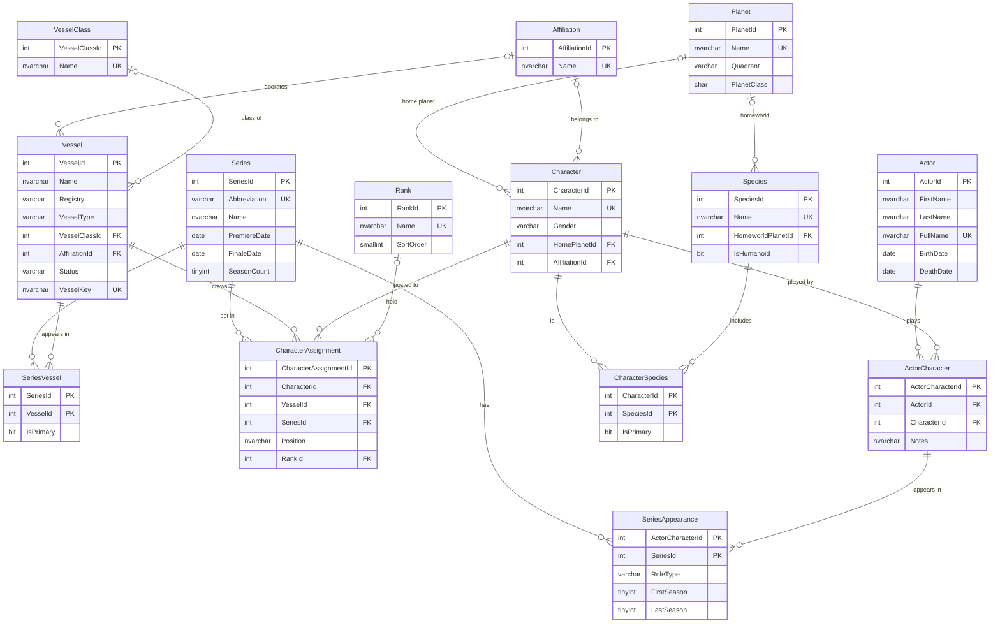

# StarTrek.Database

A Star Trek themed demo database for **Azure SQL Database** / **SQL Server**. It covers actors, the characters they played, the series they appeared in, and the ships and stations those characters served on. Species, planets, affiliations and ranks are included too.

It's built as an SDK-style [SQL Database Project](https://learn.microsoft.com/sql/tools/sql-database-projects/sql-database-projects) (`Microsoft.Build.Sql`). The schema is declarative, and the seed data loads through an idempotent post-deployment script.

## Scope

| Series | Abbreviation |
|---|---|
| Star Trek: The Original Series | `TOS` |
| Star Trek: The Next Generation | `TNG` |
| Star Trek: Deep Space Nine | `DS9` |
| Star Trek: Voyager | `VOY` |
| Star Trek: Enterprise | `ENT` |
| Star Trek: Strange New Worlds | `SNW` (data current through season 3) |

The data covers main casts plus key recurring characters (about 150 characters and 160 actors). Season ranges and role types are best-effort. Birth dates are only populated where they're well known, so expect `NULL`s; that's handy for demos anyway.

**Future phase:** films and the Kelvin timeline.

### Reference data sources

The seed data was hand-compiled rather than imported, so use these to verify or extend it:

- [Memory Alpha](https://memory-alpha.fandom.com/wiki/Portal:Main): the canon Star Trek wiki, covering characters, actors, species, planets, ships and starbases.
- [StarTrek.com Database](https://www.startrek.com/database): the official franchise reference.
- [STAPI](https://stapi.co/): a free, open Star Trek REST API, handy for bulk-loading more data.
- [Wikipedia: List of Star Trek characters](https://en.wikipedia.org/wiki/List_of_Star_Trek_characters).
- Series cast lists on IMDb and Memory Alpha:

| Series | IMDb | Memory Alpha |
|---|---|---|
| TOS | [tt0060028](https://www.imdb.com/title/tt0060028/fullcredits) | [TOS](https://memory-alpha.fandom.com/wiki/Star_Trek:_The_Original_Series) |
| TNG | [tt0092455](https://www.imdb.com/title/tt0092455/fullcredits) | [TNG](https://memory-alpha.fandom.com/wiki/Star_Trek:_The_Next_Generation) |
| DS9 | [tt0106145](https://www.imdb.com/title/tt0106145/fullcredits) | [DS9](https://memory-alpha.fandom.com/wiki/Star_Trek:_Deep_Space_Nine) |
| VOY | [tt0112178](https://www.imdb.com/title/tt0112178/fullcredits) | [VOY](https://memory-alpha.fandom.com/wiki/Star_Trek:_Voyager) |
| ENT | [tt0244365](https://www.imdb.com/title/tt0244365/fullcredits) | [ENT](https://memory-alpha.fandom.com/wiki/Star_Trek:_Enterprise) |
| SNW | [tt12327578](https://www.imdb.com/title/tt12327578/fullcredits) | [SNW](https://memory-alpha.fandom.com/wiki/Star_Trek:_Strange_New_Worlds) |

## Schema



### Design notes

- **Actor ↔ Character is many-to-many** (`ActorCharacter`).
  - One character can have several actors, for example Spock is played by Leonard Nimoy and Ethan Peck, and Pike by three actors.
  - One actor can play several characters, for example Brent Spiner plays Data, Lore, Noonien Soong and Arik Soong.
- **`SeriesAppearance`** records an actor-as-character in a series as `Main`, `Recurring` or `Guest`, with a season range.
- **`CharacterSpecies`** supports hybrids such as Spock, Troi and B'Elanna. A filtered unique index (`UX_CharacterSpecies_OnePrimary`) enforces one primary species per character.
- **`CharacterAssignment`** records who served on which ship or station, in which series, in what position and at what rank.
- **`Vessel.VesselKey`** is a persisted computed column (`ISNULL(Registry, Name)`). It gives every vessel a unique natural key, including those without a registry, such as Deep Space 9.
- **Conventions:**
  - Constraints are named explicitly (`PK_`, `FK_`, `UQ_`, `CK_`, `DF_`, `IX_`, `UX_`).
  - Every FK column is indexed.
  - `CHECK` constraints cover enumerations and season and date ranges.
  - Every table has a `CreatedAt DATETIME2(0)` column defaulting to `SYSUTCDATETIME()`.

## Project layout

```
StarTrek.Database.sqlproj
global.json                           pins the minimum .NET SDK (10.0)
dbo/Tables/*.sql                      one file per table, with its indexes
Scripts/PostDeployment/
    Script.PostDeployment.sql         includes the seed files in dependency order
    Seed.Lookups.sql                  Series, Affiliation, Rank, VesselClass
    Seed.PlanetsSpecies.sql           Planet, Species
    Seed.Vessels.sql                  Vessel, SeriesVessel
    Seed.Actors.sql                   Actor
    Seed.Characters.sql               Character, CharacterSpecies
    Seed.Appearances.sql              ActorCharacter, SeriesAppearance
    Seed.Assignments.sql              CharacterAssignment
Scripts/Demo/DemoQueries.sql          demo queries: joins, recasts, window functions, PIVOT, ROLLUP...
```

Each seed file:

1. Loads its rows into a temp table.
2. Validates every lookup, and `THROW`s with a clear message if a name doesn't resolve.
3. `MERGE`s into the target on the natural key.

Re-publishing is safe: changed rows are updated, new rows are inserted, and nothing is deleted.

## Requirements

| Tool | Version | Used for | Install |
|---|---|---|---|
| [.NET SDK](https://dotnet.microsoft.com/download/dotnet/10.0) | 10.0 or later, latest patch recommended (enforced by `global.json`) | Building the project (`Microsoft.Build.Sql` 2.3.0 SDK, restored from NuGet automatically), and running SqlPackage. The SDK includes the runtime. | `winget install Microsoft.DotNet.SDK.10` |
| [SqlPackage](https://learn.microsoft.com/sql/tools/sqlpackage/sqlpackage-download) | 170.x | Publishing the `.dacpac` | `dotnet tool install -g microsoft.sqlpackage` |
| [SQL Server Express LocalDB](https://learn.microsoft.com/sql/database-engine/configure-windows/sql-server-express-localdb) | 2019 or later | Local target (optional) | Included with Visual Studio, or via the SQL Server Express installer |
| [sqlcmd](https://learn.microsoft.com/sql/tools/sqlcmd/sqlcmd-utility) | Any | Running the demo queries from the command line (optional) | `winget install sqlcmd` |
| [Azure CLI](https://learn.microsoft.com/cli/azure/install-azure-cli) | Any | Signing in for Azure SQL (`Active Directory Default`) (optional) | `winget install Microsoft.AzureCLI`, then `az login` |

Optional editors: VS Code with the the **SQL Database Projects** extension, or Visual Studio 2022 17.12+ with SQL Server Data Tools, SDK-style.

Check what's installed:

```powershell
dotnet --list-sdks
dotnet --list-runtimes
sqlpackage /Version
sqllocaldb info
```

> **.NET 10 is the minimum.** .NET 8 reaches end of support in November 2026. `global.json` in this folder requires SDK 10.0.100 or later; newer major versions are allowed.
>
> **Keep .NET 10 patched.** Recent SqlPackage builds need a recent .NET 10 runtime patch (for example, SqlPackage 170.5.x needs 10.0.11+), and won't start on an older one. If `sqlpackage` fails with *"You must install or update .NET to run this application"*, update .NET 10 (`winget upgrade Microsoft.DotNet.SDK.10`) or pin an older tool, e.g. `dotnet tool update -g microsoft.sqlpackage --version 170.2.70`.

## Build and publish

```powershell
cd src\Databases\StarTrek.Database
dotnet build

dotnet tool install -g microsoft.sqlpackage

# LocalDB
sqlpackage /Action:Publish `
  /SourceFile:bin\Debug\StarTrek.Database.dacpac `
  /TargetConnectionString:"Server=(localdb)\MSSQLLocalDB;Database=StarTrek;Integrated Security=true;TrustServerCertificate=true"

# Azure SQL Database (Microsoft Entra authentication)
sqlpackage /Action:Publish `
  /SourceFile:bin\Debug\StarTrek.Database.dacpac `
  /TargetConnectionString:"Server=tcp:<server>.database.windows.net,1433;Database=StarTrek;Authentication=Active Directory Default;Encrypt=True"
```

You can also open the project in VS Code (SQL Database Projects extension) or Visual Studio and publish from there.

## Demo queries

Open `Scripts\Demo\DemoQueries.sql` against the published database. Highlights include:

- Recast characters and multi-role actors (`STRING_AGG ... WITHIN GROUP`)
- Actors appearing across the most series
- `LEFT JOIN` vs `NOT EXISTS` anti-joins (the runabout USS Rio Grande has no crew on purpose)
- Hybrid species via conditional aggregation
- Window functions (`DENSE_RANK`, `COUNT(*) OVER`)
- `PIVOT`, `GROUP BY ROLLUP`, and a filtered index seek (`IX_SeriesAppearance_MainCast`)
